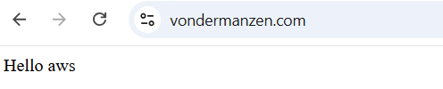
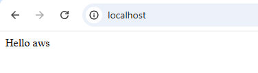

© The Chancellor, Masters and Scholars of The University of Oxford. All rights reserved.

# Explore different providers

This course is available for multiple cloud providers. Choose your preferred platform:

- [Hello Google Cloud](https://github.com/Oxford-Research-Cloud-Competency-Centre/Hello-gcloud)
- [Hello Microsoft Azure](https://github.com/Oxford-Research-Cloud-Competency-Centre/Hello-mazure)
- [Hello Amazon Web Services](https://github.com/Oxford-Research-Cloud-Competency-Centre/Hello-aws) (⭐ Most popular)
- Hello Oracle Cloud *(Coming Soon)*

*Note: Entries marked with "Coming Soon" are planned versions that are currently under development.*

# Instructions

<details>
<summary>Step 1. Fork (or make a copy of) this repository</summary>


***
</details>
<details>
<summary>Step 2. Go to the AWS Console and type "app runner" in the search bar</summary>


***
</details>
<details>
<summary>Step 3. Create a new service</summary>


***
</details>
<details>
<summary>Step 4. Select source code repository and link your repository</summary>


***
</details>
<details>
<summary>Step 5. Set deployment to automatic</summary>


***
</details>
<details>
<summary>Step 6. Select "Use a configuration file" (apprunner.yaml is already in the repository)</summary>


***
</details>

<details>
<summary>Step 7. Choose a name for your service and deploy it. Default settings like 1 CPU and 2 GB RAM are enough.</summary>


***
</details>

Voilà! Access the URL.


***

# Going further

<details>
<summary><h2>Modifying the code</h2></summary>

You can commit some changes to your repository and watch how the service is updated automatically.


</details>

<details>
<summary><h2>Using a custom domain</h2></summary>

<details>
<summary>Step 1. If you want to use a custom domain (like hello.com), just click "Link domain".</summary>


***
</details>
<details>
<summary>Step 2. If you are using Route 53, then AWS should create the record for you. You don't need to do this step but you might need to delete the records manually when you remove the service.</summary>


***
</details>
Voilà! 



</details>

<details>
<summary><h2>Cleaning up</h2></summary>

Don't forget to delete your service when you are no longer using it. You can always redeploy later.


</details>

<details>
<summary><h2>Adding an API endpoint</h2></summary>

Add the following code in app.py

```	
@app.route("/hello_api")
def hello_api():
    return {
		"name": "Wrinkle Five Star",
		"species": "Duck",
		"breed": "American Pekin",
		"hatching_date": "2020-09-09",
		"sex": "Male"
    }
```

Then test your endpoint


</details>

<details>
<summary><h2>User interface</h2></summary>

In app.py, change the default route from "index.html" to "user_interface.html"

```	
@app.route("/")
def home():
    return render_template("user_interface.html")
```

Access the URL again and make sure the duck appears. 


</details>

<details>
<summary><h2>Database writing/reading</h2></summary>

<details>
<summary>Go to the AWS Console and type "RDS" in the search bar</summary>
Missing content
</details>

</details>

<details>
<summary><h2>Storage bucket writing/reading</h2></summary>

<details>
<summary>Go to the AWS Console and type "S3" in the search bar</summary>
Missing content
</details>

</details>

<details>
<summary><h2>Testing on your local machine</h2></summary>

After a while, it's not fun anymore to wait for deployment. You want to test your changes before. 

<details>
<summary>Step 1. Install git and clone the repository on your local machine</summary>

```	
	git clone {repository_link}
```

***
</details>
<details>
<summary>Step 2. Install Python</summary>

```	
https://www.python.org/downloads/
```

***
</details>
<details>
<summary>Step 3. Install dependencies</summary>

```	
	 py -m pip install flask
```

***
</details>
<details>
<summary>Step 4. Run flask</summary>

```	
	 py -m flask run
```

Open localhost:5000 in your browser.  

***
</details>



</details>

<details>
<summary><h2>Running a job on a separate machine</h2></summary>

This web server is not powerful enough to handle sophisticated tasks. What if GPUs are needed for a heavy workflow? Then you need the ability to create machines dynamically and control them remotely (Infrastructure as Code). 

<details>
<summary>Install dependencies</summary>
Missing content
</details>

</details>

# Working through CLI on your local machine

<details>
<summary><h2>Setup the AWS CLI</h2></summary>

<details>
<summary>Step 1. Install the AWS CLI on your local machine</summary>

https://docs.aws.amazon.com/cli/latest/userguide/getting-started-install.html

***
</details>

<details>
<summary>Step 2. In the AWS Console, go to security credentials </summary>


***
</details>

<details>
<summary>Step 3. Create an access key </summary>


***
</details>

<details>
<summary>Step 4. Configure AWS on your local machine</summary>

Command: aws configure


***
</details>
</details>


<details>
<summary><h2>Upload the app to Elastic Container Registry</h2></summary>

<details>
<summary>Step 1. Install Python on your local machine </summary>

https://www.python.org/downloads/

***
</details>

<details>
<summary>Step 2. Install Docker on your local machine </summary>

https://www.docker.com/get-started/

***
</details>

<details>
<summary>Step 3. Run script upload_ecr_image.py </summary>


***
</details>

<details>
<summary>Step 4. In the AWS Console search bar, type "ecr" </summary>


***
</details>

<details>
<summary>Step 5. Check that the repository appears </summary>


***
</details>

<details>
<summary>Step 6. Now you can go back to creating an App Runner service using the ECR. You have the choice to do that through the AWS Console again, or programmatically with a script in the next section.</summary>


***
</details>

</details>


<details>
<summary><h2>Create the service using the ECR image</h2></summary>

<details>
<summary>Step 1. Run script create_service.py </summary>


***
</details>
<details>
<summary>Step 2. Go to the AWS Console and type "app runner" in the search bar</summary>


***
</details>
<details>
<summary>Step 3. Check the service is up and running</summary>


***
</details>

</details>


