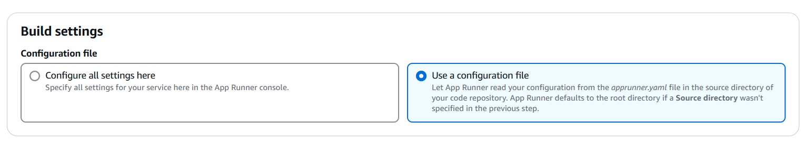

© Chancellors, Masters and Scholars of The University of Oxford. All rights reserved.

# Explore different providers

This course is available for multiple cloud providers. Choose your preferred platform:

- [Hello Google Cloud](https://github.com/Oxford-Research-Cloud-Competency-Centre/Hello-gcloud)
- [Hello Microsoft Azure](https://github.com/Oxford-Research-Cloud-Competency-Centre/Hello-mazure)
- [Hello Amazon Web Services](https://github.com/Oxford-Research-Cloud-Competency-Centre/Hello-aws) (⭐ Most popular)
- Hello Oracle Cloud *(Coming Soon)*
- Hello IBM Cloud *(Coming Soon)*
- Hello Tencent Cloud *(Coming Soon)*
- Hello Alibaba Cloud *(Coming Soon)*
- Hello Baidu AI Cloud *(Coming Soon)*

*Note: Entries marked with "Coming Soon" are planned versions that are currently under development.*

# Instructions

Step 1. Fork (or make a copy of) this repository
<details>
<summary>Step 2. Go to the AWS Console and type "app runner" in the search bar</summary>


***
</details>
<details>
<summary>Step 3. Create a new service</summary>


***
</details>
<details>
<summary>Step 4. Select source code repository and link your repository</summary>


***
</details>
<details>
<summary>Step 5. Set deployment to automatic</summary>


***
</details>
<details>
<summary>Step 6. Select "Use a configuration file" (apprunner.yaml is already in the repository)</summary>



***
</details>

<details>
<summary>Step 7. Choose a name for your service and deploy it. Default settings like 1 CPU and 2 GB RAM are enough.</summary>


***
</details>

Voilà! Access the URL.


***

# Going further

## Modifying the code

<details>
<summary>You can commit some changes to your repository and watch how the service is updated automatically. </summary>


</details>

## Using a custom domain 

<details>
<summary>Step 1. If you want to use a custom domain (like hello.com), just click "Link domain".</summary>


***
</details>
<details>
<summary>Step 2. If you are using Route 53, then AWS should create the record for you. You don't need to do this step but you might need to delete the records manually when you remove the service.</summary>


***
</details>
Voilà! 


## Cleaning up

<details>
<summary>Don't forget to delete your service when you are no longer using it. You can always redeploy later. </summary>


</details>

## Adding an API endpoint

<details>
<summary>Add the following code in app.py</summary>

```	
@app.route("/hello_api")
def hello_api():
    return {
		"name": "Wrinkle Five Star",
		"species": "Duck",
		"breed": "American Pekin",
		"hatching_date": "2020-09-09",
		"sex": "Male"
    }
```
</details>

Then test your endpoint


## User interface

<details>
<summary>...</summary>
Missing content
</details>

## Database writing/reading

<details>
<summary>Go to the AWS Console and type "RDS" in the search bar</summary>
Missing content
</details>

## Storage bucket writing/reading

<details>
<summary>Go to the AWS Console and type "S3" in the search bar</summary>
Missing content
</details>


