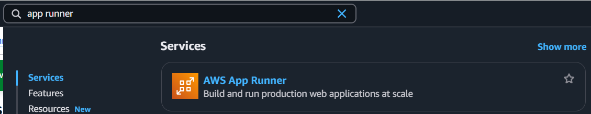
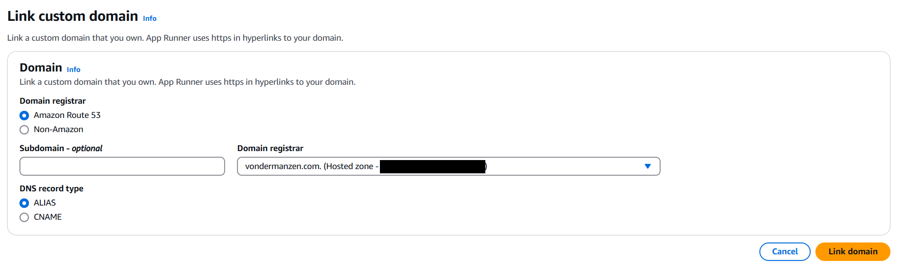
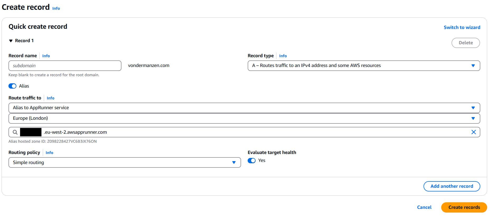

# Explore different providers

This course is available for multiple cloud providers. Choose your preferred platform:

- [Hello Google Cloud](https://github.com/Oxford-Research-Cloud-Competency-Centre/Hello-gcloud)
- [Hello Microsoft Azure](https://github.com/Oxford-Research-Cloud-Competency-Centre/Hello-mazure)
- [Hello Amazon Web Services](https://github.com/Oxford-Research-Cloud-Competency-Centre/Hello-aws)
- Hello Oracle Cloud *(Coming Soon)*
- Hello IBM Cloud *(Coming Soon)*
- Hello Tencent Cloud *(Coming Soon)*
- Hello Alibaba Cloud *(Coming Soon)*
- Hello Baidu AI Cloud *(Coming Soon)*

*Note: Entries marked with "Coming Soon" are planned versions that are currently under development.*

# Instructions

Step 1. Fork (or make a copy of) this repository

***

Step 2. Go to the Amazon Web Services Console and type "app runner" in the search bar

***

Step 3. Create a new service

***

Step 4. Select source code repository and link your repository 

***

Step 5. Set deployment to automatic

***

Step 6. Select "Use a configuration file" (apprunner.yaml is already in the repository) 

***

Step 7. Choose a name for your service and deploy it. Default settings like 1 CPU and 2 GB RAM are enough. 

***

Voilà! Access the URL.

# Going further

## Modifying the code

You commit some changes to your repository and watch how the service is updated automatically. 

## Using a custom domain 

If you want to use a custom domain (like hello.com), just click "Link domain". If you are using Route 53, then AWS should create the record for you. Certificates are managed directly for you. 

